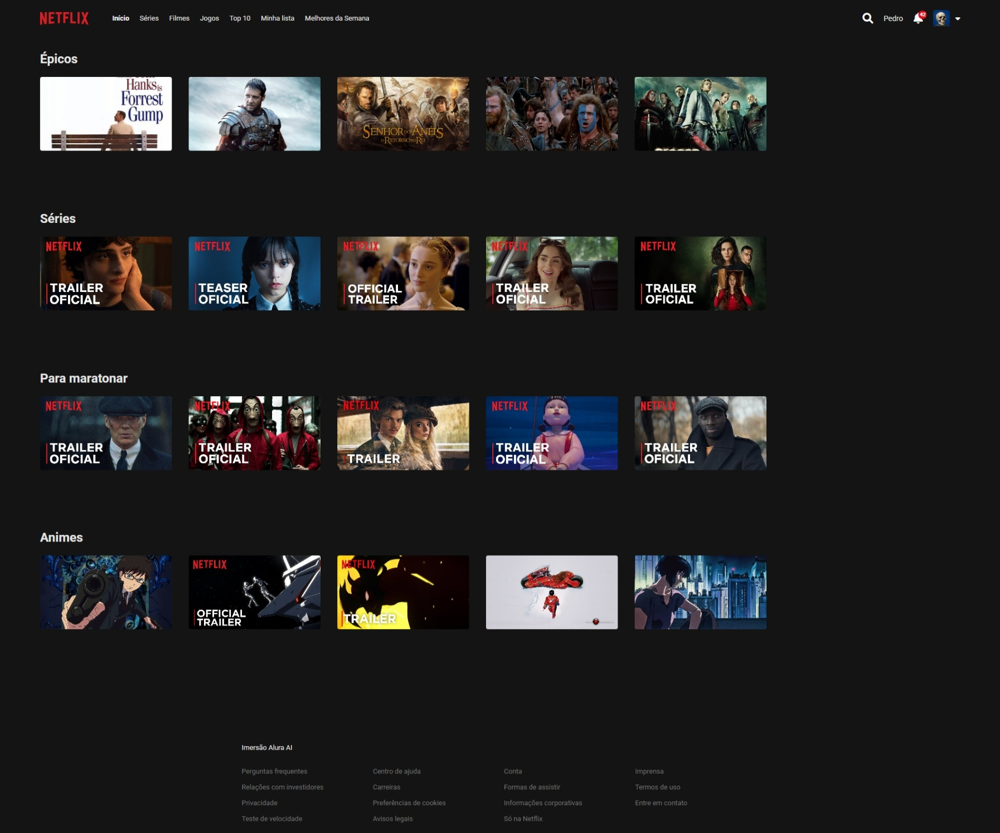

# Imersão Front-End com IA da Alura

## Masterclass: Do zero ao primeiro website com IA

Durante as aulas, mergulhamos na prática para construir um projeto real. O resultado foi uma interface inspirada na **Netflix**, desenvolvida em apenas 20 minutos com o auxílio de ferramentas de Inteligência Artificial.

[:rocket: Confira o resultado final](https://danylomoraes.github.io/imersao-frontend-ia/)

### Destaques da imersão:

- Preparamos o ambiente de desenvolvimento utilizando a extensão **Live Server** no **Visual Studio Code**.
- Criamos e finalizamos a estrutura da página com **HTML**.
- Entendemos melhor a organização e a semântica do código.
- Adicionamos o campo de busca e elementos da interface.
- Criamos o arquivo de estilos (**CSS**).
- Aplicamos a estilização inicial da página.
- Aprendemos sobre hierarquia de seletores no **CSS**.
- Geramos imagens com IA (**Google Gemini**) para representar os perfis da plataforma.
- Estruturamos o layout visual do projeto.
- Refinamos e organizamos melhor o código do projeto.
- Aprendemos conceitos que ajudam a desenvolver aplicações com mais maturidade técnica.
- Implementamos responsividade na interface com auxílio de IA.
- Criamos variáveis de **CSS** para padronizar as cores do projeto.
- Implementamos o modo claro e o modo escuro (**light**/**dark** mode).

## Interface do Projeto Finalizado

